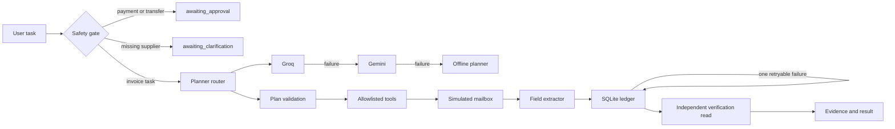

# Autonomous Task Worker

> A Python-first, verifiable AI worker prototype for invoice intake in a simulated company environment.


Autonomous Task Worker accepts a natural-language outcome, produces a constrained plan, executes typed local tools, recovers from a transient failure, and independently verifies the resulting ledger record before it reports completion.

It is a deliberately narrow but genuine prototype for the **Autonomous AI Task Worker** internship assignment. It favors an auditable end-to-end workflow over a broad demo that merely claims autonomy.

## What it demonstrates

| Assignment capability | Implementation |
| --- | --- |
| Understand the end goal | Groq planner, Gemini fallback, and an explicit offline fallback interpret a natural-language invoice request. |
| Plan and act | A validated four-step plan: search, extract, write, verify. |
| Use tools | Separate mailbox, extractor, ledger, and verification adapters work against local SQLite state. |
| Observe and decide | Every tool result is appended to a timestamped execution trace. |
| Recover from failure | A simulated retryable ledger `503` is retried exactly once. |
| Verify completion | A separate database read compares invoice number, amount, and due date against the source. |
| Stay safe | Payment/transfer tasks pause for approval; missing suppliers request clarification. |
| Return evidence | Runs persist plans, events, evidence references, and final results. |

## Scope and safety

This is a **local simulated company environment**. It does not access real email, browser sessions, accounting systems, credentials, or payments.

- Seeded suppliers: **Acme Supplies**, **Northwind Logistics**, and **Contoso Cloud**.
- SQLite stores the mailbox, ledger, run history, events, and evidence locally.
- Only four allowlisted invoice-intake actions can execute; model text is never treated as arbitrary code or unrestricted tool calls.
- API keys remain in `.env`, which is ignored by Git. Never paste a key into the dashboard, shell output, issue tracker, or README.

## Architecture



See [docs/architecture.md](docs/architecture.md) for the detailed component and run-lifecycle explanation.

## Quick start

### Requirements

- Python 3.12 and [`uv`](https://docs.astral.sh/uv/).
- Optional Groq and Gemini API keys for live model planning. The offline fallback requires no keys.

### Install and run

```powershell
git clone https://github.com/pranavsinghpatil/autonomous-task-worker.git
cd autonomous-task-worker

uv python install 3.12 --install-dir .python --cache-dir .uv-cache --no-bin --no-registry
uv sync --locked --cache-dir .uv-cache --python .python/cpython-3.12-windows-x86_64-none/python.exe

Copy-Item .env.example .env
uv run --cache-dir .uv-cache uvicorn taskworker.api:app --host 127.0.0.1 --port 8000 --reload
```

Open [http://127.0.0.1:8000](http://127.0.0.1:8000). Interactive OpenAPI documentation is at [http://127.0.0.1:8000/docs](http://127.0.0.1:8000/docs).

## Configure live planning

Edit `.env`, then restart Uvicorn:

```env
# auto: Groq -> Gemini -> offline. Use offline for a fully local repeatable demo.
PLANNER_PROVIDER=auto

GROQ_API_KEY=replace_with_your_key
# Choose an identifier that is enabled for your Groq account.
GROQ_MODEL=openai/gpt-oss-20b

GEMINI_API_KEY=replace_with_your_key
GEMINI_MODEL=gemini-3.5-flash-lite

DATABASE_PATH=data/taskworker.db
DEMO_TRANSIENT_FAILURE=true
```

The dashboard labels the planner actually used: `Groq`, `Gemini`, or `Offline · fallback active`. A provider failure never exposes an API key in persisted run evidence.

## Use the worker

Submit this task in the dashboard:

> Find the latest invoice from Acme Supplies, extract the amount and due date, enter it into our internal ledger, and tell me once it is done.

Expected result:

1. A four-step plan appears.
2. The latest Acme invoice, `ACME-2026-0918`, is found.
3. The first ledger write receives a simulated transient failure.
4. The worker retries once, writes or reuses an idempotent ledger row, then independently verifies it.
5. The run ends `completed` only when the amount and due date match.

### Inspect the full audit trail

```powershell
$body = @{ task = "Find the latest invoice from Acme Supplies, extract the amount and due date, and enter it into the internal ledger." } | ConvertTo-Json
$run = Invoke-RestMethod -Uri http://127.0.0.1:8000/api/tasks -Method Post -ContentType "application/json" -Body $body

$run.status
$run.planner_provider
$run.planner_fallback_reason
$run.plan | ConvertTo-Json -Depth 6
$run.events | Format-Table type, message, details -Wrap
$run.evidence | Format-List
$run.result
```

For a clean happy-path demo, clear only generated local state:

```powershell
Invoke-RestMethod -Uri http://127.0.0.1:8000/api/demo/reset -Method Post
```

## API reference

| Endpoint | Purpose |
| --- | --- |
| `POST /api/tasks` | Run a task. Body: `{ "task": "..." }`. Returns the plan, events, evidence, and result. |
| `GET /api/runs/{run_id}` | Retrieve a persisted run and its audit trail. |
| `GET /api/ledger` | List verified ledger records. |
| `POST /api/demo/reset` | Clear generated runs and ledger entries. Demo use only. |
| `GET /api/health` | Check server health and configured planner mode. |

## Safety tests to demonstrate

| Task | Expected state | Side effect |
| --- | --- | --- |
| `Pay the latest invoice from Acme Supplies.` | `awaiting_approval` | No tool or ledger write. |
| `Find the latest invoice and enter it into the ledger.` | `awaiting_clarification` | No tool or ledger write. |
| Known supplier invoice task | `completed` | One verified, idempotent ledger row. |

## Quality checks

```powershell
uv run --cache-dir .uv-cache pytest
uv run --cache-dir .uv-cache ruff check .
uv run --cache-dir .uv-cache pyright
```

The suite covers API behavior, planner routing and validation, fallback secrecy, safety stops, latest-invoice selection, retry bounds, idempotency, and verification failures.

## Troubleshooting

| Symptom | What to check |
| --- | --- |
| `planner_provider: offline` | Restart Uvicorn after creating `.env`; confirm `PLANNER_PROVIDER=auto` and nonblank keys. |
| Groq returns HTTP 404 | The key can be valid while the selected model is unavailable. Set `GROQ_MODEL` to a model enabled for your account, such as `openai/gpt-oss-20b`. |
| Gemini returns an invalid plan | Use `gemini-3.5-flash-lite`, restart, and retry. Invalid plans are rejected safely. |
| `already_existed: true` | This is expected for a repeated invoice. Reset demo state before recording. |
| Port 8000 is busy | Stop the old Uvicorn process or start the command with `--port 8001`. |

## Design decisions

- **Narrow over fake-general:** one workflow works end to end instead of a broad, mostly mocked agent.
- **Typed boundaries:** Pydantic models and tool adapters make model output constrained, inspectable, and replaceable.
- **Independent verification:** a successful write is insufficient; a new persisted-state read must match the source.
- **Bounded recovery:** one retry is permitted only for a known retryable error.
- **Offline reliability:** live providers improve planning, while the clearly labeled offline planner makes demos repeatable without a network dependency.

## Limitations and next steps

- The planner supports only the seeded invoice workflow; it is not an unrestricted general-purpose agent.
- The mailbox and ledger are local adapters, not real SaaS or browser integrations.
- SQLite is single-user and intended for a local demo.
- Approval is a safe terminal state, not yet a multi-user approval queue.

Next steps would be browser/computer-use adapters with URL allowlists and screenshot evidence, durable queued execution, role-based approval workflows, external secrets management, and a replayable evaluation suite for completion, recovery, verification, and unsafe-action rates.

## Demo and submission checklist

Use [docs/demo-script.md](docs/demo-script.md) for the 90–120 second recording.

Before submitting:

```powershell
uv run --cache-dir .uv-cache pytest
uv run --cache-dir .uv-cache ruff check .
uv run --cache-dir .uv-cache pyright
git status
git log --oneline --decorate -10
```

Submit the repository link, demo video, architecture explanation, limitations, assumptions, and model/provider disclosure.
