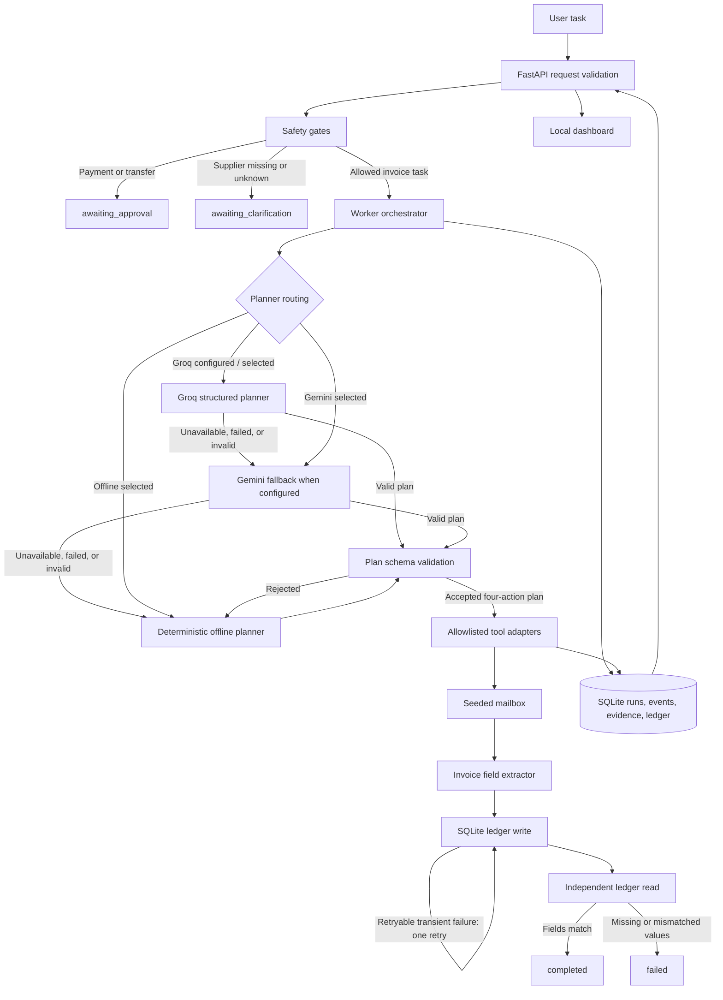

# Architecture

Autonomous Task Worker is a local, single-user prototype. The diagram shows the intended request path and its trust boundaries. Only the validated four-action plan can reach the invoice tools; planner text is never interpreted as arbitrary code or a free-form tool call.

## Components

- **Dashboard and API:** accept a task, return a run, and expose persisted run evidence and ledger state. The dashboard is served locally and makes the selected planner/provider visible.
- **Safety gates:** stop payment or transfer language for approval and require a known supplier before tools run.
- **Planner router:** prefers Groq, can use Gemini as a fallback, and always has an explicitly labeled deterministic offline path. Provider calls receive task text, so the demo should use synthetic input only.
- **Plan validator:** accepts only the invoice workflow schema and its allowlisted actions. Untrusted or malformed model output is discarded before execution.
- **Tool adapters:** search only seeded mailbox data, extract the invoice fields, write an idempotent SQLite ledger row, and perform a separate verification read.
- **Persistence:** store suppliers/invoices, runs, ordered events, evidence, and ledger entries in a local SQLite database. The dashboard's reset control is for demo data only.

## Run lifecycle

1. The API validates that a task was supplied. The worker applies approval and clarification gates before invoking the planner or tools.
2. The selected planner produces a typed plan. If a hosted response is unavailable, invalid, or fails validation, the router uses its configured fallback chain; the actual producer is recorded with the run.
3. The worker executes the supported invoice actions in order. A ledger exception is retried once only when the adapter marks that error retryable. Idempotency by invoice number prevents duplicate rows on repeat runs.
4. A separate read retrieves the persisted ledger record. Completion requires a match for invoice number, amount, and due date. A mismatch or missing row ends as a failure with evidence retained.
5. The run result, timestamped events, and evidence references are persisted for the API and dashboard.

## Boundaries and limitations

All business records are seeded local data. There is no external mailbox, accounting integration, real browser automation, payment capability, multi-user authentication, or production-grade approval workflow. Hosted planners are optional; when configured, they process the supplied task text. SQLite is intended for this local demo and not concurrent production workers.
